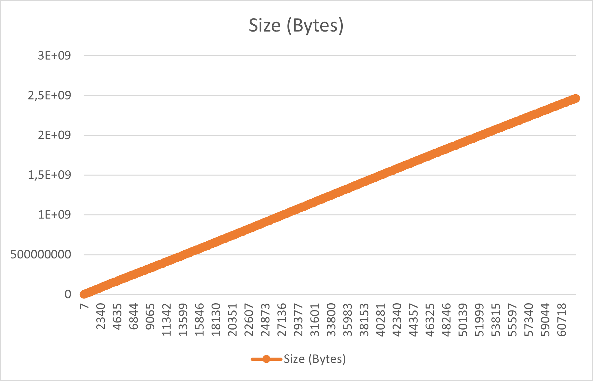
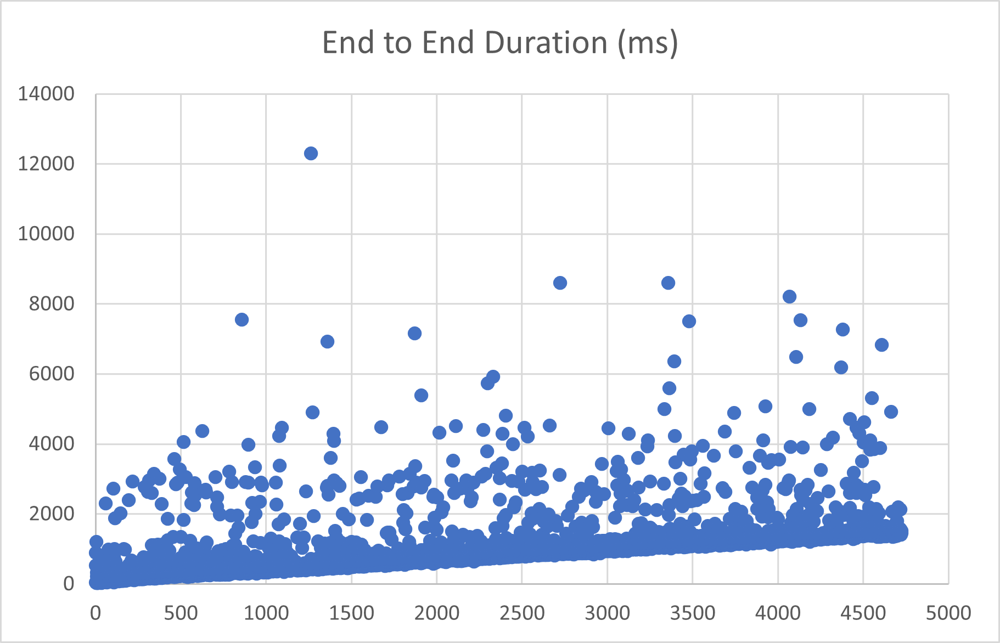

Tested with Flink 1.14.4 and Scala 2.12.

Copy `misc/flink-conf.yaml` to `$FLINK_HOME/conf/` and start a local cluster with

```shell
$FLINK_HOME/bin/start-cluster.sh
```

Build this project with

```shell
./gradlew shadowJar
```

Execute Flink program with

```shell
$FLINK_HOME/bin/flink run -d build/libs/flink-rocksdb-ttl-test-0.0.0-SNAPSHOT-shadow.jar
```

Note the resulting job id and call (maybe with `nohup`)

```shell
misc/chkstat <JOB_ID> &
```

## Results with 52ca77c

After running for 1.6 days.

<!-- -->

<!-- -->
